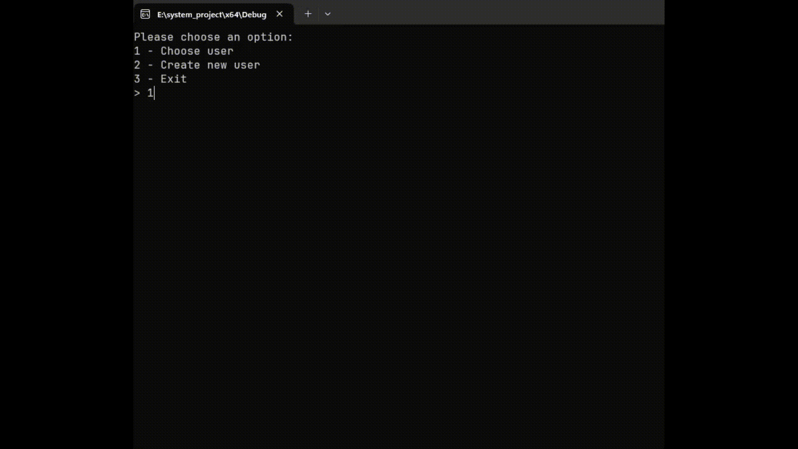
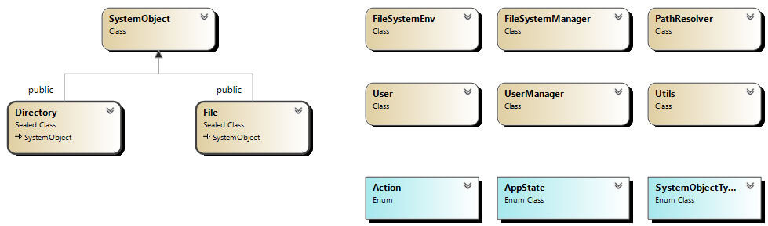
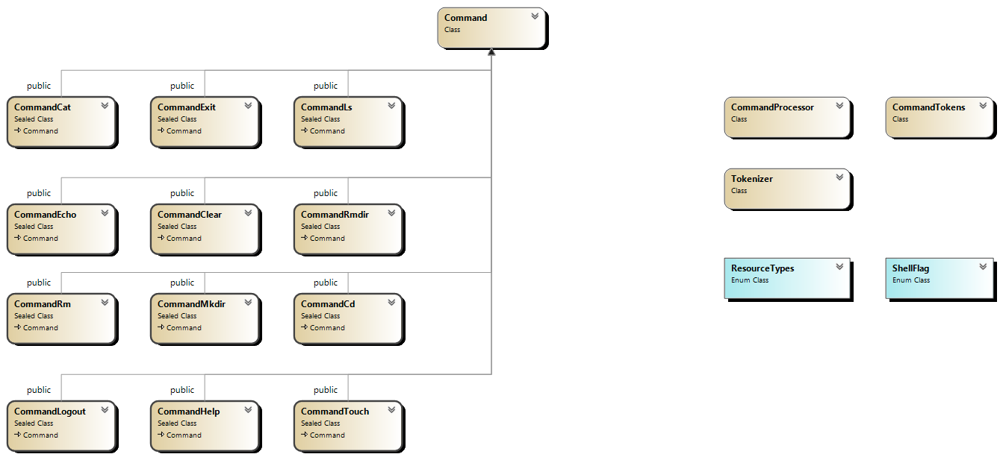

# File System

This project simulates a file system environment with permanent storage.
Users can interact with the system using a simple shell implementation.



## Dependencies

There are no dependencies

## Run it with docker

### docker build

```
docker build -t fylesystem:latest .
```

### docker run

```
docker run -it fylesystem:latest
```

## Shell Commands

- exit
- logout
- mkdir
- touch
- ls
- cd
- clear
- rmdir
- echo
- cat
- help
- rm

## Documentation

### Summary vision of the execution flow


### Summary class diagram view




